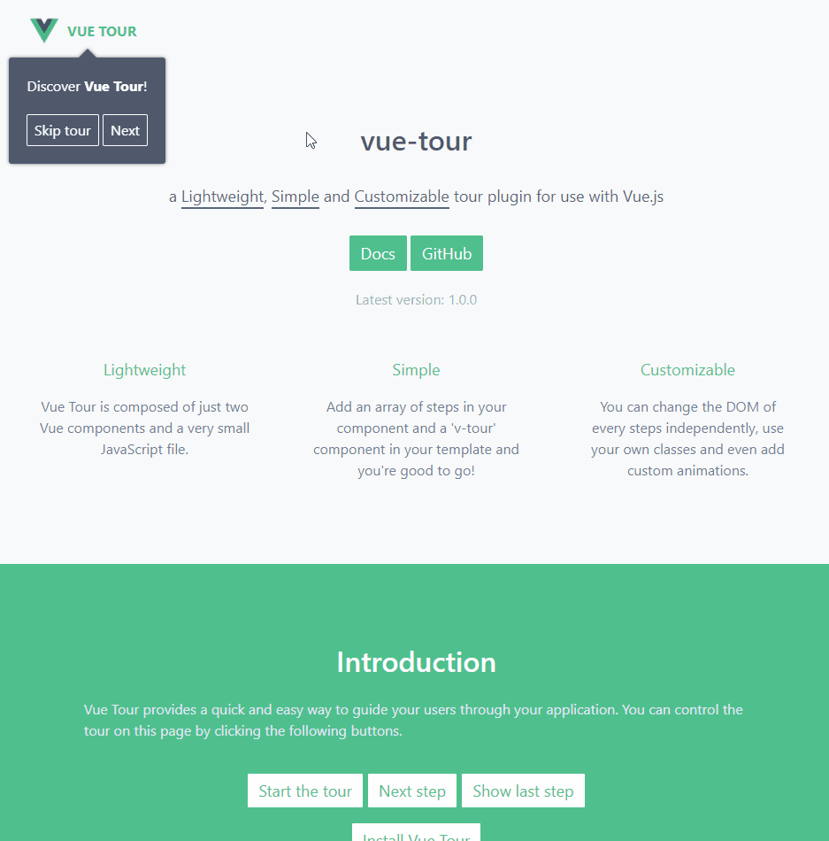

# Vue Tour

> Vue Tour is a lightweight, simple and customizable tour plugin for use with Vue.js.
> It provides a quick and easy way to guide your users through your application.

[](https://pulsardev.github.io/vue-tour/)

## Table of Contents

- [Getting Started](#getting-started)
- [Something Missing?](#something-missing)

## Getting Started

You can install `vue-tour` using npm or by downloading the minified build on GitHub.

```
npm install vue-tour
```

Then import the plugin in your application entry point (typically main.js if you used vue-cli to scaffhold your project) and tell Vue to use it.

```javascript
import Vue from 'vue'
import App from './App.vue'
import VueTour from 'vue-tour'

Vue.use(VueTour)

new Vue({
  render: h => h(App)
}).$mount('#app')
```

Finally put a v-tour component in your template anywhere in your app (usually in App.vue) and pass it an array of steps.

```html
<template>
  <div>
    <div id="v-step-0">A DOM element on your page. The first step will pop on this element because its ID is 'v-step-0'.</div>
    <div id="v-step-1">A DOM element on your page. The second step will pop on this element because its ID is 'v-step-1'.</div>
    <div id="v-step-2">A DOM element on your page. The third and final step will pop on this element because its ID is 'v-step-2'.</div>

    <v-tour name="myTour" :steps="steps"></v-tour>
  </div>
</template>

<script>
  export default {
    name: 'my-tour',
    data () {
      return {
        steps: [
          {
            target: '#v-step-0',
            content: `Discover <strong>Vue Tour</strong>!`
          },
          {
            target: '#v-step-1',
            content: 'An awesome plugin made with Vue.js!'
          },
          {
            target: '#v-step-2',
            content: 'Try it, you\'ll love it!<br>You can put HTML in the steps and completely customize the DOM to suit your needs.',
            params: {
              placement: 'top'
            }
          }
        ]
      }
    },
    mounted: function () {
      this.$tours['myTour'].start()
    }
  }
</script>
```

Once this is done and your steps correctly target some DOM elements of your application, you can start the tour by calling the following method.

```javascript
this.$tours['myTour'].start()
```

For a more detailed documentation, checkout the [docs for vue-tour](https://pulsar.gitbooks.io/vue-tour/).

## Something Missing?

If you have a feature request or found a bug, [let me know](https://github.com/pulsardev/vue-tour/issues).
